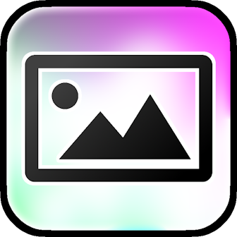
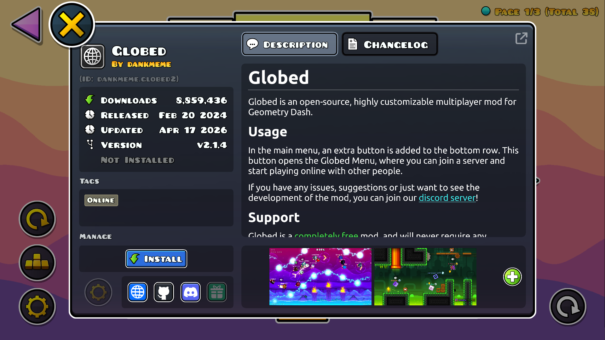
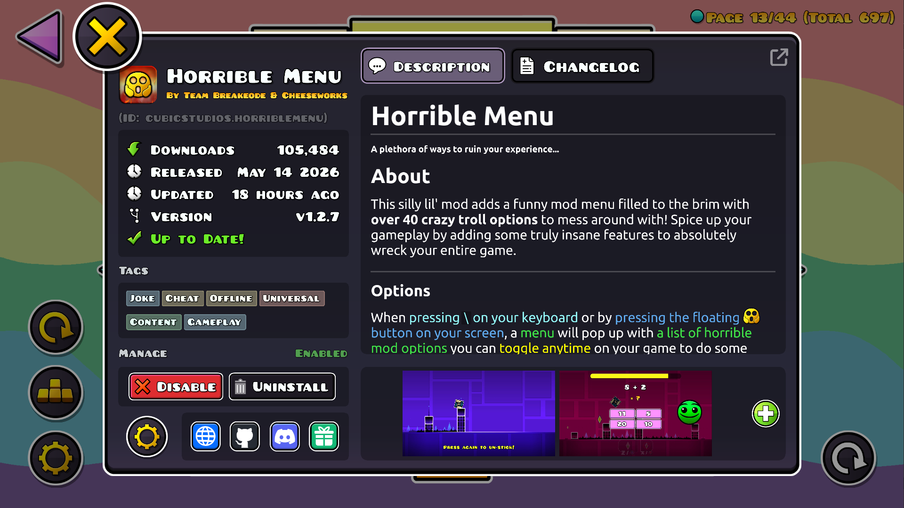

#  Mod Previews
View preview images for mods.

>   

>  
>  
> 

---

## About
This mod adds preview images to Geode mods' information pop-ups if their developer included them!

---

### Viewing
A small interface should shortly appear at the bottom of the Geode mod information pop-up, where you can view and go through pages of preview images for that mod.

### Developers
To add preview images, first add a `previews/` folder to the root your repository, to which you will be able to add up to 10 PNG images to preview your mod! Each preview image must be named with the following format.

> - `preview-`**`{num}`**`.png`

For example, `preview-4.png`, `preview-10.png`.

#### Supported Platforms
This mod supports fetching images from repositories hosted on [GitHub](https://github.com/), [GitLab](https://gitlab.com/), and any [Forgejo-based platform](https://forgejo.org/).

---

### Credits
- **[km7dev](https://www.github.com/kingminer7/)**: Wrote a good chunk of the Geode v5 port

---

---

### Changelog
###### What's new?!
**[📜 View the latest updates and patches](./changelog.md)**

### Issues
###### What's wrong?!
**[⚠️ Report a problem with the mod](../../issues/)**